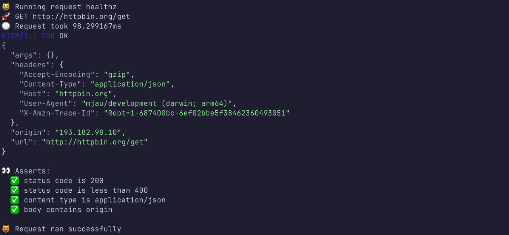

# mjau Documentation

<p align="center">
    
    <br>
    mjau - API Testing That's as Simple as a Meow
</p>

<p align="center">
    <a href="https://github.com/getmjau/mjau/actions/workflows/ci.yaml">
        
    </a>
    <a href="https://goreportcard.com/report/github.com/getmjau/mjau">
        
    </a>
    <a href="https://github.com/getmjau/mjau/releases">
        
    </a>
    <a href="https://github.com/getmjau/mjau/blob/main/LICENSE">
        
    </a>
</p>

## Table of Contents

- [What is mjau?](#what-is-mjau)
- [Quick Start](#quick-start)
- [Installation](#installation)
- [Commands](#commands)
- [Flags](#flags)
- [mjau.yaml File Structure](#mjauyaml-file-structure)
- [Commands in mjau.yaml](#commands-in-mjauyaml)
- [Standard Variables](#standard-variables)
- [Assertions](#assertions)
- [Built-in Functions](#built-in-functions)
- [Example mjau.yaml](#example-mjauyaml)
- [Why mjau?](#why-mjau)
- [Contributing](#contributing)
- [License](#license)
- [Show Your Support](#show-your-support)

### What is mjau?

mjau is a powerful and lightweight API testing tool that simplifies your testing process with a human-readable YAML-based syntax. Designed for developers and QA engineers who value speed and simplicity, mjau allows you to define and run complex test cases with minimal effort. As a single, portable binary, it runs anywhere, anytime, without any dependencies. Whether you're testing a simple endpoint or a complex API, mjau is the purr-fect tool for the job.



### Quick Start

1.  **Install mjau**:

    ```bash
    curl -sL https://getmjau.dev/install.sh | bash
    ```

2.  **Initialize a sample config**:

    ```bash
    mjau init
    ```

3.  **Run the tests**:

    ```bash
    mjau runall
    ```

### Installation

To install mjau, run the following command:

```bash
curl -sL https://getmjau.dev/install.sh | bash
```

### Commands

The tool provides the following commands:

- `mjau run <request(s)>`: Runs one or more requests, separated by commas.
- `mjau runall`: Runs all requests defined in the configuration file.
- `mjau init`: Creates a sample `mjau.yaml` configuration file.
- `mjau version`: Prints the version of the tool.

### Flags

The following flags are available:

- `--config, -c`: Specifies the configuration file to use (default: `mjau.yaml`).
- `--full-request, -F`: Prints the full request, including headers and body.
- `--request-body, -B`: Prints the request body.
- `--request-headers, -H`: Prints the request headers.
- `--body, -b`: Prints the response body.
- `--headers, -r`: Prints the response headers.
- `--show-variables, -V`: Prints all variables.
- `--show-commands, -C`: Prints all commands.
- `--show-asserts, -A`: Prints all asserts.
- `--verbose, -v`: Enables verbose output, printing everything.
- `--env, -e`: Specifies the environment to use (default: `default`).

### `mjau.yaml` File Structure

The `mjau.yaml` file has the following structure:

- **environments**: An array of environments, each with a `name` and an array of `variables`.
- **requests**: An array of requests, each with the following properties:
  - `name`: The name of the request.
  - `method`: The HTTP method to use (e.g., `GET`, `POST`).
  - `url`: The URL to send the request to.
  - `headers`: An array of key-value pairs for the request headers.
  - `body`: The request body.
  - `pre_commands`: An array of commands to run before the request.
  - `commands`: An array of commands to run after the request.
  - `asserts`: An array of assertions to validate the response.

### Commands in `mjau.yaml`

The following commands can be used in the `pre_commands` and `commands` sections of a request:

- `echo`: Prints a message to the console.
- `add_variable`: Adds a new variable or updates an existing one.
- `add_json_variable`: Extracts a value from a JSON response and stores it in a variable. The `path` uses GJSON path syntax. For more information, see the [GJSON Path Syntax](https://github.com/tidwall/gjson/blob/master/SYNTAX.md) documentation.

### Standard Variables

`mjau` provides a set of standard, built-in variables that you can use in your requests and commands:

- `{{request.name}}`: The name of the current request.
- `{{request.method}}`: The HTTP method of the current request.
- `{{request.url}}`: The URL of the current request.
- `{{request.body}}`: The body of the current request.
- `{{request.headers.<header_name>}}`: The value of a specific request header.
- `{{response.status_code}}`: The status code of the response.
- `{{response.status_text}}`: The status text of the response.
- `{{response.body}}`: The body of the response.
- `{{response.headers.<header_name>}}`: The value of a specific response header.
- `{{response.elapsed}}`: The time it took to receive the response.

### Assertions

Assertions are used to validate the response of a request. The following comparison operators are available:

- `==`: Checks if the values are equal.
- `!=`: Checks if the values are not equal.
- `>`: Checks if the actual value is greater than the expected value.
- `<`: Checks if the actual value is less than the expected value.
- `>=`: Checks if the actual value is greater than or equal to the expected value.
- `<=`: Checks if the actual value is less than or equal to the expected value.
- `contains`: Checks if the actual value contains the expected value.


### Built-in Functions

The following built-in functions can be used in the `mjau.yaml` file:

- `{{$uuid()}}`: Generates a new UUID.
- `{{$timestamp()}}`: Returns the current timestamp in RFC3339 format.
- `{{$random(max)}}`: Generates a random integer up to the specified maximum value.

### Example `mjau.yaml`

```yaml
# This is a sample mjau configuration file
# You can use this file as a template for your own configuration
environments:
  - name: dev
    variables:
      - key: base_url
        value: https://api.dev.example.com
  - name: prod
    variables:
      - key: base_url
        value: https://api.example.com

requests:
  - name: create_user
    method: POST
    url: {{environment.base_url}}/users
    headers:
      - key: Content-Type
        value: application/json
    body: |
      {
        "name": "test-user-{{$random(1000)}}",
        "email": "test-user-{{$random(1000)}}@example.com"
      }
    commands:
      - command: add_json_variable
        description: "get the user id from the response"
        variable: user_id
        from_variable: response.body
        path: id

  - name: get_user
    method: GET
    url: {{environment.base_url}}/users/{{user_id}}
    asserts:
      - description: "status code is 200"
        variable: response.status_code
        comparison: "=="
        value: 200
      - description: "response body contains user id"
        variable: response.body
        comparison: contains
        value: "{{user_id}}"

  - name: delete_user
    method: DELETE
    url: {{environment.base_url}}/users/{{user_id}}
    asserts:
      - description: "status code is 204"
        variable: response.status_code
        comparison: "=="
        value: 204
```

### Why mjau?

- **Declarative and Readable**: Define your tests in a clean, human-readable YAML format. No more writing boilerplate code, just describe your API calls and assertions.
- **Zero Dependencies**: `mjau` is a single, self-contained binary. Drop it into your project or CI/CD pipeline and it just works. No need to worry about managing dependencies or virtual environments.
- **Powerful and Flexible**: Don't let the simplicity fool you. `mjau` is a powerful tool that can handle complex API testing scenarios. With features like environments, variables, and commands, you can create sophisticated test suites that are easy to maintain and extend.
- **Fast and Lightweight**: `mjau` is written in Go, which means it's fast and lightweight. It won't slow down your development workflow or your CI/CD pipeline.

### Contributing

Contributions are welcome! If you have any ideas, suggestions, or bug reports, please open an issue on the GitHub repository. If you want to contribute code, please fork the repository and submit a pull request.

### License

This project is licensed under the MIT License - see the [LICENSE](LICENSE) file for details.

### Show Your Support

If you like this project, please give it a star on GitHub! This will help other people discover the project and encourage me to continue working on it.